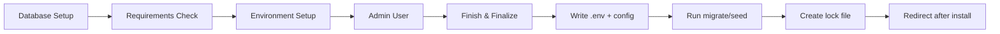

# 🚀 Laravel Installer

<p align="center">
	<strong>A clean, wizard-based installer for Laravel apps</strong><br>
	Built with Livewire 4 + Spatie Livewire Wizard.
</p>

<p align="center">
	<a href="#-features">Features</a> •
	<a href="#-quick-start">Quick Start</a> •
	<a href="#-configuration">Configuration</a> •
	<a href="#-customization">Customization</a> •
	<a href="#-security--behavior">Security</a>
</p>

<p align="center">
	
	
	
	
</p>

---

## ✨ Overview

`zisunal/laravel-installer` provides a guided installation flow at `/install` (configurable) that helps you:

- collect database and environment details,
- validate runtime requirements,
- create the first admin user,
- run migrations and optional seeders,
- write `.env` and config values,
- lock the installer after completion.

It also includes middleware to redirect non-install routes to the installer until setup is complete.

---

## 📸 Installation Flow



Default ordered steps:

1. **Database** (`WelcomeStep`)
2. **Requirements** (`RequirementsStep`)
3. **Environment** (`EnvironmentStep`)
4. **Admin User** (`AdminUserStep`)
5. **Finish** (`FinishStep`)

---

## 🔥 Features

- ✅ Livewire wizard with visual progress
- ✅ Config-driven route prefix, middleware, and post-install redirect
- ✅ Runtime requirements check (PHP version, extensions, permissions)
- ✅ Optional app key generation, migration, and seeding
- ✅ Admin user bootstrap with configurable model + role attribute
- ✅ Automatic installer lock file support
- ✅ Step discovery for custom installer steps
- ✅ Middleware guard to force installation before app usage

---

## ⚡ Quick Start

### 1) Install package

```bash
composer require zisunal/laravel-installer
```

### 2) Run setup command

```bash
php artisan installer:setup
```

> Use `--force` to republish installer config:

```bash
php artisan installer:setup --force
```

### 3) Open installer UI

Visit:

```text
/install
```

> Convenience tip: if you prepend `Zisunal\LaravelInstaller\Middleware\Installed` in `bootstrap/app.php`, users are automatically redirected to the installer when the app is not installed yet.

Example:

```php
->withMiddleware(function (Middleware $middleware): void {
	$middleware->prepend(\Zisunal\LaravelInstaller\Middleware\Installed::class);
})
```

---

## 💡 Local Development Tip

When testing/using this package locally, use the **PHP built-in server** instead of `composer run dev` or `php artisan serve`. You can use `composer run dev` or `php artisan ` once the installation is completed:

```bash
php -S localhost:8000 -t public
```

**Why?** The development servers (`artisan serve`, Vite hot-reload) restart when the `.env` file is modified. Since the installer writes to `.env` during finalization, server restarts break the installation workflow. The built-in server is stable and won't auto-restart on file changes.

⚠️ **Note:** This is only a concern for local development. On production servers, the `.env` file is typically committed and static, so no restart occurs during installation.

---

## 🧩 What `installer:setup` does

The command:

- publishes `config/installer.php` (`installer-config` tag),
- ensures `InstallerServiceProvider` is in `bootstrap/providers.php`,
- generates app key (if empty and enabled),
- creates `public/storage` link (if enabled).

---

## ⚙️ Configuration

Publish config (if you have not done it already):

```bash
php artisan vendor:publish \
	--provider="Zisunal\\LaravelInstaller\\InstallerServiceProvider" \
	--tag="installer-config"
```

Key options in `config/installer.php`:

| Key                        | Purpose                                | Default                        |
| -------------------------- | -------------------------------------- | ------------------------------ |
| `enabled`                | Enable/disable installer routes        | `true`                       |
| `route_prefix`           | Installer URI prefix                   | `install`                    |
| `redirect_after_install` | Redirect target after finish           | `/admin`                     |
| `lock_file`              | Installation lock file path            | `storage/app/installed.lock` |
| `middleware`             | Route middleware stack                 | `['web']`                    |
| `generate_app_key`       | Auto-generate app key                  | `true`                       |
| `run_migrations`         | Auto-run migrations                    | `true`                       |
| `run_seeders`            | Auto-run seeders                       | `true`                       |
| `database_seeder`        | Specific seeder class                  | `null`                       |
| `storage_link`           | Create public storage symlink          | `true`                       |
| `admin_model`            | Model used for first admin             | `App\\Models\\User::class`   |
| `admin_role_attribute`   | Role field name on model               | `role`                       |
| `admin_role_value`       | Role value assigned to admin           | `owner`                      |
| `steps`                  | Manually registered step classes       | package defaults               |
| `providers_to_register`  | Providers to append to bootstrap list  | `[]`                         |
| `discover.enabled`       | Auto-discover step classes             | `true`                       |
| `discover.paths`         | Discovery directories for custom Steps | `[]`                         |

## 🛠️ Customization

### Custom installer URL

```php
'route_prefix' => 'setup',
```

### Custom redirect after install

```php
'redirect_after_install' => '/dashboard',
```

### Custom admin model + role behavior

```php
'admin_model' => App\\Models\\Admin::class,
'admin_role_attribute' => 'user_type',
'admin_role_value' => 'super_admin',
```

### Add providers during finalization

```php
'providers_to_register' => [
	App\Providers\CustomServiceProvider::class,
],
```

### Add your own installer steps

#### Quick scaffold with Artisan

Generate a new installer step with Livewire component and view:

```bash
php artisan make:installer-step
```

The command will ask you for:

1. **Installer step title** — e.g. `Redis Setup`
2. **Installer step description** — e.g. `Configure Redis connection settings.`
3. **Installer step order** — position in the wizard (1–99), defaults to next available
4. **Where to create** — if auto-discovery is enabled, choose among discoverable paths; otherwise auto-placed in `app/Installer/Steps`

This creates:

- `app/Installer/Steps/RedisSetupStep.php` (Livewire component)
- `resources/views/installer/steps/redis-setup.blade.php` (view)

Then customize the component and view as needed.

#### Option A — manual registration

```php
'steps' => [
		\Zisunal\LaravelInstaller\Livewire\Steps\WelcomeStep::class,
		App\Installer\Steps\LicenseAgreementStep::class,
		\Zisunal\LaravelInstaller\Livewire\Steps\RequirementsStep::class,
		\Zisunal\LaravelInstaller\Livewire\Steps\EnvironmentStep::class,
		\Zisunal\LaravelInstaller\Livewire\Steps\AdminUserStep::class,
		\Zisunal\LaravelInstaller\Livewire\Steps\FinishStep::class,
],
```

#### Option B — auto-discovery

```php
'discover' => [
		'enabled' => true,
		'paths' => [
				app_path('Installer/Steps') => 'App\\Installer\\Steps',
		],
],
```

Your step class must extend:

```php
Zisunal\LaravelInstaller\Livewire\Steps\AbstractInstallerStep
```

---

## 🧠 Runtime Behavior

On **Finish**, the installer manager will:

1. finalize DB connection config in memory,
2. run migrations (if enabled),
3. run seeders (if enabled),
4. create/update admin user,
5. clear caches,
6. write lock file,
7. write environment/config values,
8. register configured providers,
9. redirect to configured destination.

---

## 🔐 Security & Behavior

- Installer route is blocked when lock file exists.
- Global `installed` middleware can redirect users to installer when app is not installed.
- Sensitive values in summary (like passwords/tokens) are masked in preview.

---

## 🧪 Reset / Re-run Installer (Development)

To run the installer again in a dev environment, remove the lock file:

```bash
rm -f storage/app/installed.lock
```

If needed, also republish config:

```bash
php artisan installer:setup --force
```

---

## 🧷 Route & Middleware Integration

- Routes are loaded automatically by the package service provider.
- Installer route name is: `installer.index`.
- Middleware alias registered by package: `installed`.

Use it on your app routes when you want hard installation gating:

```php
Route::middleware(['web', 'installed'])->group(function () {
		// protected routes here
});
```

---

## 🤝 Contributing

Issues and pull requests are welcome.

If you contribute UI-related improvements, keep the wizard flow minimal, clear, and production-friendly.

---

## 📄 License

MIT
